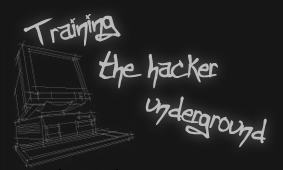
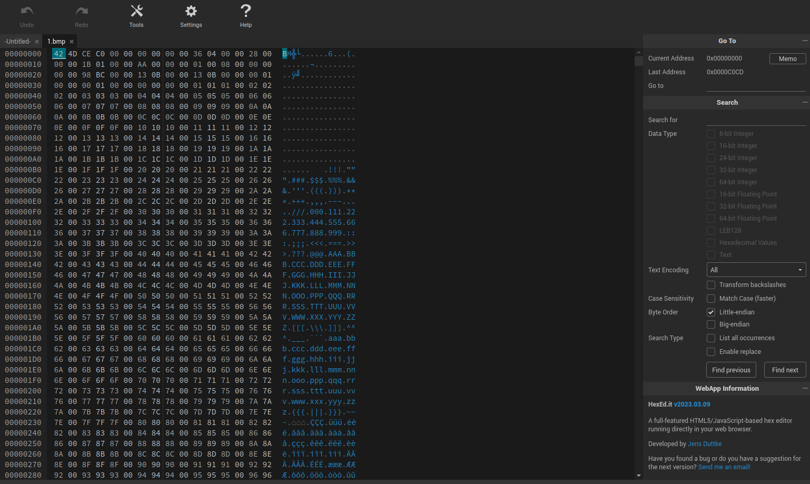
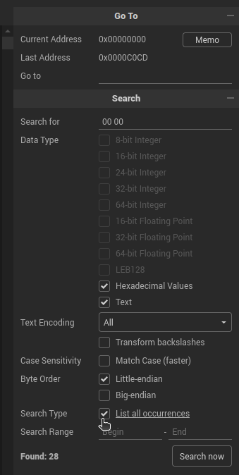

# Level 1

# Challenge Text

> This is an encoded message, the only tip you get is '2 null bytes'

> Thank (or blame :P) tiksi for making this challenge

> NOTE: There is no encoding error, stop submitting bug reports about it.

## Writeup



For this challenge we're given [an image](./1.bmp "Level 1 Image") with a message hidden inside. The only hint we're given is "2 null bytes". It's safe to assume with this hint that within the image are two null bytes that are being used as a marker or a delimiter. This is a way for the recipient of the hidden message to find it by simply looking for the agreed upon marker.

In order to look for the two null bytes we'll need a program to view a [hexdump](https://en.wikipedia.org/wiki/Hex_dump "Wikipedia Entry For HExdump") of the image. In linux you can use the [xxd](https://www.howtoforge.com/linux-xxd-command/ "How To Forge Article On Linux XXD Command") command, if you don't have Linux you can use a browser based hex editor like [hexed.it](https://hexed.it/ "Online Hex Editor"), for this example I'll be using the online hex editor.

After opening the file in a hex editor, we should see the following output.



To the right of the hex editor we'll find a search function. We'll use this to search for ```00 00```, our two hex bytes. Next we'll click the option ```List all occurences```.



Once we've clicked on the search button with our new options set, we'll see a bunch of matches around the header of the hexdump. Ignore these.


Moving past the null bytes around the header area, we'll only find two other null bytes in the whole hexdump and they're right near each other. This should set off a red flag. It seems that they may be markers, and the data between them may be our message.


If we take the hex values between the two null bytes we found, we'll see only a series of 16's and 17's.

```
16 16 17 17 17 16 16 16 16 17
17 16 16 17 17 16 16 17 17 16 17 17
17 16 17 17 16 17 16 16 16 16 17 17
16 16 16 16 17 16 17 17 17 16 16 17
17 16 16 17 17 16 17 17 16

```

Assuming this challenge involves [least significant bit](https://www.computerhope.com/jargon/l/leastsb.htm "Computer Hope Article On Least Significant Bit") steganography, we should extract the right most bit from each byte, and group them together. Later, we can convert these values to [ASCII](https://en.wikipedia.org/wiki/ASCII "Wikipedia Article On ASCII").

We'll start by converting the hexadecimal values 16 and 17 to binary with this [hex to binary converter](https://www.rapidtables.com/convert/number/hex-to-binary.html "Hex To Binary Converter") and taking the right most bit.

| **HEX** | **BINARY** | **LSB** |
|:-------:|:----------:|:-------:|
| 16      | 00010110   | 0       |
| 17      | 00010111   | 1       |

Now that we know 16's represent 0's and 17's represent 1's, we can replace every 16 and 17. That leaves us with the following.

```0011100001100110011011101101000011000010111001100110110```

If we break this collection of bits into bytes (groups of 8) we'll notice we're missing a bit.

* 00111000
* 01100110
* 01101110
* 11010000
* 11000010
* 11100110
* **0110110 <-- Missing Bit**

Honestly, this is where I got stuck and needed to look online for help. After looking around I was able to find a video from a guy named Chuck Moore. He 